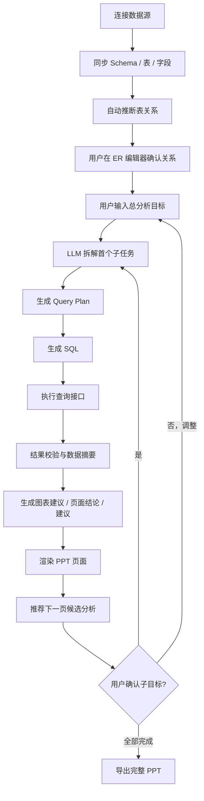

# Vibe Data Analysis 智能体架构与需求说明

## 1. 目标

构建一个面向业务分析场景的智能体系统，完成以下闭环：

1. 连接数据库或其他数据源。
2. 拉取 schema、表、字段、主外键候选关系。
3. 在 ER 图编辑器中由用户确认或补充表关系。
4. 用户输入分析目标，LLM 将其拆解为可执行分析任务。
5. 基于 ER 关系、元数据和任务上下文生成 SQL。
6. 通过查询接口获取数据并做结果校验。
7. 自动生成带图表、结论、建议的 PPT 页面。
8. 基于当前目标完成情况和已有数据，提出下一页建议分析方向。
9. 与用户确认子目标后重复执行，直到形成完整分析报告。

该系统需要支持未来扩展：

- 多源数据联合分析
- Deep Research
- RAG / 业务知识库
- 素材检索
- Skills 插件机制

## 2. 设计原则

- 简洁分层：先把“数据接入、语义理解、分析执行、PPT 生成”四层打通。
- 人在回路：ER 关系确认、目标确认、关键 SQL 执行前可人工介入。
- 状态化编排：整个分析过程不是单次问答，而是一个可持续推进的 `Analysis Session`。
- 可解释：每页 PPT 都要保留“用了哪些表、SQL、图表、结论、建议”的来源链路。
- 可扩展：核心编排层不直接耦合具体数据源、检索方式、研究方式、素材能力。

## 3. 系统架构

### 3.1 分层架构

### 3.2 核心模块职责

#### 1) 前端工作台

负责统一承载以下交互：

- 数据源连接配置
- schema 浏览与表选择
- ER 图关系确认
- 分析目标输入与子目标确认
- SQL 预览与执行状态
- 单页 PPT 预览与整份导出

#### 2) Analysis Orchestrator

系统核心编排器，负责维护 `Analysis Session` 状态，并驱动每一轮分析：

- 当前总目标
- 当前子目标
- 可用数据域
- 已确认 ER 模型
- 已执行 SQL 与结果摘要
- 已生成页面
- 下一步候选分析建议

这是全系统最重要的控制平面，建议用状态机实现，而不是纯 prompt 串联。

#### 3) Schema & Metadata Service

负责连接数据源并抽取统一元数据：

- 数据源类型、连接信息、权限信息
- 库、表、字段、类型、注释
- 主键、外键、索引、时间字段、指标字段
- 表级样本、行数估计、更新时间

输出统一的 `Schema Snapshot`，供 LLM 和 ER 编辑器使用。

#### 4) ER Model Store + Editor

负责保存“机器推断 + 用户修正”后的业务关系图：

- 表关系
- join 条件
- 基数
- 业务别名
- 可信度
- 生效版本

SQL 生成必须优先依赖这里的已确认关系，而不是只依赖数据库原生外键。

#### 5) Semantic Planning Service

负责把用户目标翻译成结构化分析任务：

- 目标理解
- 指标识别
- 维度识别
- 时间范围识别
- 分析方法选择
- 页面类型规划

输出推荐结构：

- `analysis_intent`
- `task_list`
- `required_tables`
- `required_metrics`
- `chart_candidates`
- `completion_criteria`

#### 6) SQL Generation Service

负责把结构化任务转换为可执行 SQL：

- 基于 ER 模型选择 join path
- 基于元数据约束字段与聚合方式
- 生成 SQL + 参数
- 生成 SQL explanation
- 生成风险提示

建议采用“两阶段生成”：

1. 先产出结构化查询计划 `Query Plan`
2. 再将计划编译为 SQL

这样更利于校验和多源扩展。

#### 7) Query Execution Service

负责安全执行与结果标准化：

- SQL 白名单 / 只读限制
- 执行超时控制
- 行数限制
- 重试与错误分类
- 查询结果缓存
- 结果表格标准化

输出：

- `result_table`
- `data_profile`
- `execution_log`
- `lineage`

#### 8) Insight & Narrative Service

负责把查询结果转化为 PPT 可用内容：

- 指标摘要
- 异常点识别
- 趋势与对比结论
- 业务解释
- 风险和建议

每页至少输出：

- 页面标题
- 图表建议
- 关键发现
- LLM 总结
- 行动建议

#### 9) PPT Composition Service

负责把结构化页面内容变成真实 PPT 页面：

- 页面模板选择
- 图表映射
- 文本布局
- 页脚来源信息
- 页内总结与建议
- 整份 deck 导出

当前仓库已有的 `FastAPI + PptxGenJS` 能直接承接这一层。

#### 10) Next Goal Recommender

在每轮完成后结合当前分析结果推荐下一页：

- 补充解释型页面
- 下钻页面
- 对比页面
- 原因分析页面
- 风险与建议页面
- 结论汇总页面

它输出的是“候选子目标”，最终由用户确认后进入下一轮。

#### 11) Skill / Tool Bus

统一承载未来扩展能力：

- 多源 join
- RAG 检索
- 外部研究
- 素材搜索
- 专用分析技能

原则是扩展能力只增强编排器，不直接破坏主链路。

## 5. 端到端流程

## 6. 功能需求说明

### 6.1 核心功能

#### A. 数据接入

- 支持配置数据库连接。
- 支持拉取数据库、schema、表、字段元数据。
- 支持表搜索、字段搜索、采样预览。
- 支持数据源权限检查。

#### B. 关系建模

- 自动识别主外键与候选 join path。
- 提供 ER 图可视化编辑。
- 支持人工新增、删除、修改关系。
- 支持关系版本保存与复用。

#### C. 任务理解与规划

- 支持自然语言输入分析目标。
- 能将目标拆解为顺序执行的子任务。
- 能判断哪些页面适合做概览、对比、趋势、归因、建议。

#### D. SQL 生成与执行

- 基于 ER 模型生成 SQL。
- 执行前可展示 SQL 解释。
- 支持失败重试与错误诊断。
- 支持多 SQL 任务。
- 支持结果缓存。

#### E. 页面生成

- 每页包含标题、图表、关键发现、总结、建议。
- 支持单页预览、修改、重生成。
- 支持整份 PPT 连续导出。

#### F. 交互式推进

- 每轮分析后推荐下一页候选方向。
- 用户可确认、删除、改写子目标。
- 支持查看“当前已完成什么、还差什么”。

### 6.2 非功能需求

#### 安全

- 默认只读查询。
- 禁止危险 SQL。
- 记录审计日志。

#### 性能

- schema 同步可缓存。
- 查询结果可缓存。
- 支持异步任务执行。

#### 可观测性

- 每个任务保留 prompt、query plan、SQL、执行日志、页面输出。
- 能快速定位失败点在“理解、SQL、执行、可视化”的哪一层。

#### 可扩展性

- 数据源连接器插件化。
- 检索、研究、素材、skills 通过统一扩展接口接入。
- SQL 生成与执行层为多源联邦查询预留抽象。

## 11. 一句话架构结论

这个系统最合适的形态不是“单个会写 SQL 的 Agent”，而是：

**一个以 `Analysis Session` 为中心、以 `ER 模型` 为语义底座、以 `Query Plan -> SQL -> Insight -> Slide` 为主执行链路、并允许用户逐轮确认子目标的状态化分析智能体平台。**

